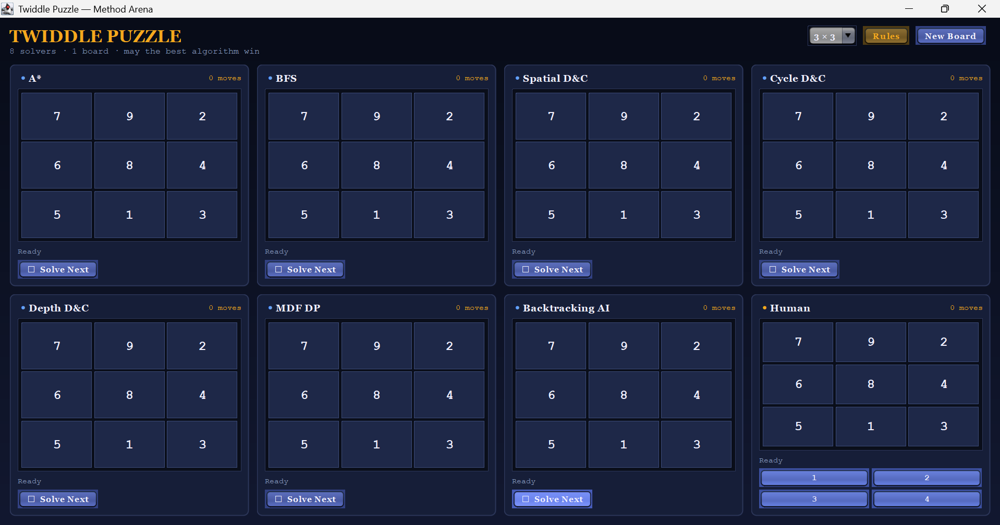

# Twiddle Puzzle Solver (Java)


A **Java implementation of the Twiddle Puzzle**, an *N×N tile puzzle* where the only allowed move is **rotating a 2×2 sub-square** (**counter-clockwise** in this codebase).

The project demonstrates and compares multiple **algorithmic approaches** for solving the puzzle and provides both:

- **Command Line Interface (CLI)**
- **Interactive Swing GUI**

This project was developed as part of the **Design and Analysis of Algorithms (DAA)** coursework.

---

## Table of Contents

- [Project Objective](#project-objective)
- [Puzzle Rules](#puzzle-rules)
- [Algorithms Implemented](#algorithms-implemented)
- [Algorithm Comparison](#algorithm-comparison)
- [Project Structure](#project-structure)
- [Requirements](#requirements)
- [How to Run (CLI)](#how-to-run-cli)
- [How to Run (GUI)](#how-to-run-gui)
- [GUI Preview](#gui-preview)
- [Notes on MDF DP Solver](#notes-on-mdf-dp-solver)
- [Contributing](#contributing)
- [License](#license)

---

## Project Objective

The goal of this project is to explore and compare **different algorithmic strategies** for solving the Twiddle Puzzle.

It focuses on:

- Understanding **search algorithms**
- Applying **dynamic programming**
- Exploring **divide and conquer strategies**
- Comparing **algorithm efficiency and behavior**

The project allows users to observe solver behavior through both **step-by-step CLI mode** and a **visual GUI interface**.

---

## Puzzle Rules

The Twiddle Puzzle consists of an **N × N board of numbered tiles**.

Example goal state for a 3×3 board:

```
1 2 3
4 5 6
7 8 9
```

### Allowed Move (Important: direction in this repo)

A move selects a **2×2 sub-square** and rotates it **counter-clockwise**.

Example (counter-clockwise):

```
1 2
4 5
```

becomes

```
2 5
1 4
```

### Move Indexing

For an **N × N board**, there are:

```
(N - 1) × (N - 1)
```

possible 2×2 rotations.

They are numbered in **row-major order**:

```
move = 1  → top-left 2×2
move = 2  → next 2×2 in top row
...
move = (N-1)*(N-1) → bottom-right 2×2
```

---

## Algorithms Implemented

**Notation**

- `N` = board size (N×N)
- `b` = branching factor = number of legal moves per state = `(N-1)^2`
- `d` = depth (number of moves) of the found solution / shortest solution
- `V` = number of reachable states that are actually explored/stored by an algorithm

> Note: Many complexities below are given in terms of `b` and `d` because the state space grows extremely quickly.

### 1) Breadth-First Search (BFS)

- **Idea / Explanation:** Explores states level-by-level from the start configuration. Since all moves have the same cost, BFS returns a **shortest-move** solution (if one is found in reachable space).
- **Optimal:** Yes (shortest number of moves)
- **Time Complexity:** `O(b^d)` (worst case)
- **Space Complexity:** `O(b^d)` (stores a queue + visited set of explored states)

### 2) A* Search

- **Idea / Explanation:** Best-first search that expands the state with smallest `f(n) = g(n) + h(n)` (moves so far + heuristic estimate). In this repo the heuristic is based on a “misplaced tiles”-style estimate adapted for 2×2 twiddles.
- **Optimal:** Yes *if* the heuristic is admissible/consistent; otherwise it may still work well but optimality is not guaranteed. (The implementation here is primarily for comparison/experimentation.)
- **Time Complexity:** `O(b^d)` (worst case; typically fewer expansions than BFS in practice)
- **Space Complexity:** `O(b^d)` (priority queue + closed map can grow very large)

### 3) Bidirectional BFS

- **Idea / Explanation:** Runs BFS simultaneously from:
  - the **start** state (forward moves), and
  - the **goal** state (using **inverse** moves),
  stopping when the two frontiers meet. This often reduces work from ~`b^d` to ~`b^(d/2)` in practice.
- **Optimal:** Yes (shortest number of moves, under standard BFS assumptions)
- **Time Complexity:** ~`O(b^(d/2))` typical, still exponential in the worst case
- **Space Complexity:** ~`O(b^(d/2))` typical (two visited maps/frontiers)

### 4) Divide & Conquer Variants (Spatial / Cycle / Depth)

These approaches are implemented as strategy variants in the same solver class (see `ComputerPlayer2`) and are primarily **heuristic/constructive** methods intended for experimentation and comparison.

#### 4.1 Spatial D&C
- **Idea / Explanation:** Attempts to improve the board by focusing on sub-regions (recursively considering submatrices) and selecting rotations that improve a heuristic score locally + globally.
- **Optimal:** Not guaranteed
- **Time Complexity:** Heuristic-dependent (can degrade toward exponential search in worst cases)
- **Space Complexity:** Typically modest (maps/sets for best-seen heuristic states + recursion overhead), but depends on exploration

#### 4.2 Cycle-based D&C
- **Idea / Explanation:** Uses structured move patterns (“cycles” / “macros”) intended to reposition tiles with limited disruption to already-fixed parts of the board.
- **Optimal:** Not guaranteed
- **Time Complexity:** Heuristic/macro-dependent
- **Space Complexity:** Typically modest; depends on how many states are evaluated

#### 4.3 Depth-based D&C
- **Idea / Explanation:** A depth-limited, staged improvement strategy. It searches/looks ahead to a fixed depth and chooses moves based on heuristic improvements.
- **Optimal:** Not guaranteed
- **Time Complexity:** Approximately `O(b^k)` per decision stage with depth limit `k` (implementation-dependent)
- **Space Complexity:** Approximately `O(k)` to `O(b^k)` depending on whether it stores explored nodes (implementation-dependent)

### 5) MDF DP Solver (Precomputed Table from the Goal)

- **Idea / Explanation:** Builds a **DP table / lookup policy** by running a BFS outward from the **goal state** using **inverse rotations**.  
  For each discovered state, it stores:
  - the distance to the goal, and
  - a “best move” that should move the state closer to the goal.

- **Important Implementation Note:** The DP table is capped by a maximum number of stored states (default is large but still finite). If the cap is reached, the table becomes **truncated** and the solver uses the partial table as a best-effort policy.

- **Optimal:** Yes *within the portion of the state space covered by the DP table*.
- **Time Complexity (build):** `O(V * b)` where `V` is the number of states actually stored in the table
- **Space Complexity (build):** `O(V)` (distance + bestMove maps)
- **Time Complexity (per move after build):** Typically `O(1)` if the direct bestMove exists; otherwise it may scan all moves: `O(b)`
- **Space Complexity (runtime):** `O(V)` for the stored table

### 6) Iterative Deepening Backtracking

- **Idea / Explanation:** Depth-first search with gradually increasing depth limit (iterative deepening). This keeps memory low like DFS, while still being complete like BFS (eventually), assuming depth is allowed to increase sufficiently.
- **Optimal:** Yes, in the “shortest move count” sense *if* the depth is increased until the first solution is found (standard IDDFS property).
- **Time Complexity:** `O(b^d)` (worst case)
- **Space Complexity:** `O(d)` (recursion stack + current path), plus bookkeeping for visited states within an iteration

### 7) Top-Down DP (Memoized IDDFS)

- **Idea / Explanation:** Combines iterative deepening with a memoization table. It caches subproblems of the form:
  - `(state, remainingDepth) → bestMove / failure`
  reducing repeated computation across the search.
- **Optimal:** Typically yes for the searched depth bound (it increases depth to find a short solution), but bounded by the maximum depth it tries.
- **Time Complexity:** Worst-case still exponential, but often reduced in practice by pruning + memoization
- **Space Complexity:** `O(V)` for memoization (keys include remaining depth), plus recursion stack `O(d)`

---

## Algorithm Comparison

> “Optimal” below means “guarantees a shortest-move solution” under typical assumptions.

| Algorithm          | Strategy                       | Optimal | Typical Performance                        | Space Use |
|-------------------|--------------------------------|---------|---------------------------------------------|----------|
| BFS               | Uninformed search              | Yes     | Slow on large boards / deep solutions       | Very High |
| A*                | Heuristic best-first search    | Depends | Usually faster than BFS (heuristic-driven)  | Very High |
| Bidirectional BFS | Meet-in-the-middle BFS         | Yes     | Often much faster than BFS                  | High |
| Spatial D&C       | Heuristic / region-based       | No      | Variable                                     | Low–Moderate |
| Cycle D&C         | Heuristic / macro-like moves   | No      | Variable                                     | Low–Moderate |
| Depth D&C         | Heuristic + depth-limited look | No      | Variable                                     | Low–Moderate |
| MDF DP            | Precomputed DP table from goal | Yes*    | Very fast when table covers the state       | Very High |
| Backtracking      | Iterative deepening            | Yes*    | Can be slow; depends heavily on pruning     | Low |
| Top-Down DP       | Memoized iterative deepening   | Yes*    | Variable; can prune many repeats            | Moderate |

\* Notes:
- MDF DP is optimal only for states covered by the built table (and the table can be truncated).
- IDDFS-style solvers are optimal when they search increasing depths until first solution, but implementations may cap the depth.

---

## Project Structure

```
Twiddle_puzzle_solver
│
├── src
│   ├── game
│   │   ├── Main.java
│   │   ├── Board.java
│   │   ├── GameEngine.java
│   │   ├── Player.java
│   │   ├── ComputerPlayer.java         (BFS / A*)
│   │   ├── ComputerPlayer2.java        (Spatial/Cycle/Depth D&C)
│   │   ├── ComputerPlayer3.java        (MDF DP table builder + policy)
│   │   ├── DPFlow.java                 (MDF DP session/step runner)
│   │   ├── BacktrackingPlayer.java     (Iterative deepening backtracking)
│   │   ├── TopDownDPPlayer.java        (Memoized IDDFS)
│   │   ├── BidirectionalBFSPlayer.java (Bidirectional BFS)
│   │
│   └── gui
│       └── TwiddleGUI.java
│
├── images
│   └── gui.png
│
├── README.md
└── report.pdf
```

### Key Files

| File | Description |
|------|-------------|
| `Main.java` | CLI entry point (choose board size, mode, solver) |
| `Board.java` | Board representation + executes the **counter-clockwise** twiddle move |
| `ComputerPlayer.java` | BFS + A* implementations |
| `ComputerPlayer2.java` | Divide & Conquer variants (Spatial/Cycle/Depth) |
| `ComputerPlayer3.java` | MDF DP (build table from goal using inverse moves) |
| `DPFlow.java` | Orchestrates MDF DP initialization + step-by-step play |
| `BacktrackingPlayer.java` | Iterative deepening backtracking solver |
| `TopDownDPPlayer.java` | Top-down DP (memoized iterative deepening) |
| `BidirectionalBFSPlayer.java` | Bidirectional BFS solver |
| `TwiddleGUI.java` | Swing-based graphical interface |

---

## Requirements

- **Java 8 or higher** (recommended: Java 11+)
- No external dependencies
- Uses **Java Standard Library + Swing**

---

## How to Run (CLI)

From the project root:

### Compile

```bash
javac -d out $(find src -name "*.java")
```

### Run

```bash
java -cp out game.Main
```

### CLI Menu

You will be prompted for:

1) Board size `N`

2) Mode

```
1 → Human vs Computer
2 → Computer Only
```

3) Solver Algorithm

```
1 BFS
2 A*
3 Spatial D&C
4 Cycle D&C
5 Depth D&C
6 MDF DP
7 Backtracking AI
8 Top-Down DP
9 Bidirectional BFS
```

---

## Computer Only Mode

In computer-only mode:

- Press **ENTER** to execute the next solver move
- Type **q** to quit

This mode allows you to **observe algorithm behavior step-by-step**.

---

## How to Run (GUI)

After compiling:

```bash
javac -d out $(find src -name "*.java")
java -cp out gui.TwiddleGUI
```

If the GUI does not include a `main()` method, you can:

- Launch it through **Eclipse / IntelliJ**
- Or create a small **GUI launcher class**

---

## GUI Preview

*(Add a screenshot of your GUI here)*



---

## Notes on MDF DP Solver

The **MDF DP solver** builds a **precomputed table of reachable states** starting from the goal configuration using inverse moves.

Advantages:

- Very fast move selection when the current state exists in the DP table
- Provides an estimated “distance-to-goal” for many states

Limitations:

- **Memory usage increases extremely quickly** with board size and the number of stored states
- The table can become **truncated** if it reaches the configured state limit, making it a partial policy

Recommended usage:

```
N ≤ 3
```

---

## Contributing

Contributions are welcome.

If you add a new solver:

1. Implement a new class extending the `Player` abstraction (via `AbstractPlayer`)
2. Ensure the solver works with the `Board` API and move indexing
3. Update this README with the algorithm explanation + time/space complexity

---

## License

This project was developed as part of a **Design and Analysis of Algorithms (DAA) academic course**.

You are free to study and modify the code for **educational purposes**.
